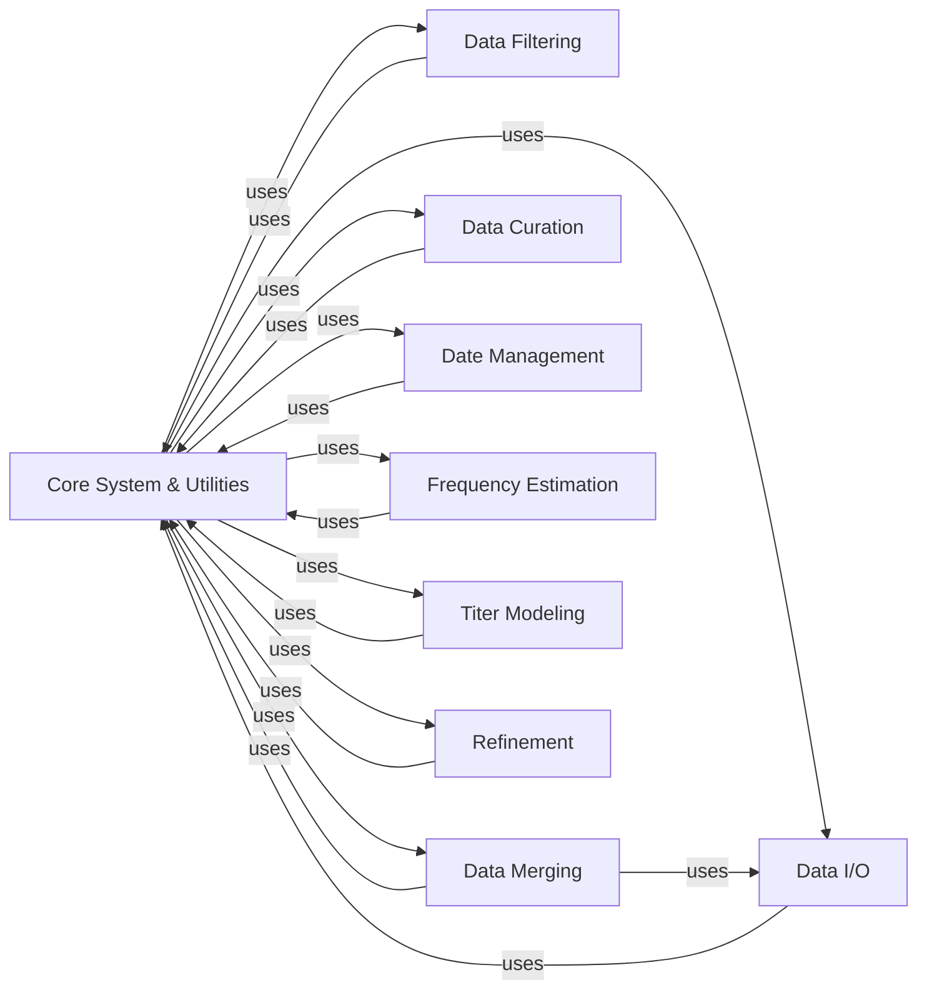

## Details

Detailed overview of the identified components, their responsibilities, and their interactions within the Augur application. These components are fundamental because they represent distinct, cohesive areas of functionality essential for the application's data processing pipeline.

### Core System & Utilities [[Expand]](./Core_System_Utilities.md)

This foundational component provides the essential infrastructure and common utilities that underpin the entire Augur application. It is responsible for parsing command-line arguments, managing application versioning, and establishing a robust, centralized error handling framework. Additionally, it offers a comprehensive suite of general-purpose utilities for common operations such as file I/O (though specific I/O is often delegated to `augur.io`), JSON serialization, and defining core data structures and enumerations used across the system. It acts as the central nervous system, providing fundamental building blocks and configuration for the application's various modules.

**Related Classes/Methods**:

- <a href="https://github.com/nextstrain/augur/augur/__init__.py#L0-L0" target="_blank" rel="noopener noreferrer">`augur.__init__` (0:0)</a>

- <a href="https://github.com/nextstrain/augur/augur/__main__.py#L0-L0" target="_blank" rel="noopener noreferrer">`augur.__main__` (0:0)</a>

- <a href="https://github.com/nextstrain/augur/augur/argparse_.py#L0-L0" target="_blank" rel="noopener noreferrer">`augur.argparse_` (0:0)</a>

- <a href="https://github.com/nextstrain/augur/augur/errors.py#L0-L0" target="_blank" rel="noopener noreferrer">`augur.errors` (0:0)</a>

- <a href="https://github.com/nextstrain/augur/augur/types.py#L0-L0" target="_blank" rel="noopener noreferrer">`augur.types` (0:0)</a>

- <a href="https://github.com/nextstrain/augur/augur/utils.py#L0-L0" target="_blank" rel="noopener noreferrer">`augur.utils` (0:0)</a>

- <a href="https://github.com/nextstrain/augur/augur/debug.py#L0-L0" target="_blank" rel="noopener noreferrer">`augur.debug` (0:0)</a>

- <a href="https://github.com/nextstrain/augur/augur/version.py#L0-L0" target="_blank" rel="noopener noreferrer">`augur.version` (0:0)</a>

- `augur.util_support` (0:0)

### Data I/O

Manages the reading and writing of various data formats used throughout the Augur application, including metadata, sequences, and other structured data. It provides the necessary interfaces for data persistence and retrieval, acting as the primary gateway for data entering and leaving the system.

**Related Classes/Methods**:

- `augur.io` (0:0)

- <a href="https://github.com/nextstrain/augur/augur/io/metadata.py#L0-L0" target="_blank" rel="noopener noreferrer">`augur.io.metadata` (0:0)</a>

- <a href="https://github.com/nextstrain/augur/augur/io/sequences.py#L0-L0" target="_blank" rel="noopener noreferrer">`augur.io.sequences` (0:0)</a>

### Data Filtering

Implements logic for filtering and subsampling datasets based on specified criteria, such as quality metrics, geographic location, or temporal ranges. This ensures that downstream analyses operate on relevant and manageable subsets of data, improving performance and focus.

**Related Classes/Methods**:

- `augur.filter` (0:0)

- <a href="https://github.com/nextstrain/augur/augur/filter/weights_file.py#L0-L0" target="_blank" rel="noopener noreferrer">`augur.filter.weights_file` (0:0)</a>

### Data Merging

Handles the integration and combination of data from disparate sources, such as merging metadata with sequence data, or combining results from different analytical steps. It ensures that all necessary information is consolidated into comprehensive datasets for subsequent processing.

**Related Classes/Methods**:

- <a href="https://github.com/nextstrain/augur/augur/merge.py#L0-L0" target="_blank" rel="noopener noreferrer">`augur.merge` (0:0)</a>

- <a href="https://github.com/nextstrain/augur/augur/merge.py#L0-L0" target="_blank" rel="noopener noreferrer">`augur.merge.metadata` (0:0)</a>

### Data Curation

Provides functionalities for cleaning, validating, and enriching data, including the application of specific rules like geolocation or date validation. This component aims to improve data quality, consistency, and completeness, making it more reliable for scientific analysis.

**Related Classes/Methods**:

- `augur.curate` (0:0)

- <a href="https://github.com/nextstrain/augur/augur/curate/apply_geolocation_rules.py#L0-L0" target="_blank" rel="noopener noreferrer">`augur.curate.apply_geolocation_rules` (0:0)</a>

### Date Management

Manages date-related operations, including parsing, validation, and manipulation of date information associated with data entries. This is critical for temporal analyses and ensuring chronological consistency.

**Related Classes/Methods**:

- `augur.dates` (0:0)

- <a href="https://github.com/nextstrain/augur/augur/dates/errors.py#L0-L0" target="_blank" rel="noopener noreferrer">`augur.dates.errors` (0:0)</a>

### Frequency Estimation

Implements algorithms for estimating frequencies of genetic variants or other features within populations, often utilizing kernel density estimation (KDE) methods on alignments or phylogenetic trees. This provides insights into the prevalence and dynamics of specific traits.

**Related Classes/Methods**:

- <a href="https://github.com/nextstrain/augur/augur/frequency_estimators.py#L0-L0" target="_blank" rel="noopener noreferrer">`augur.frequency_estimators` (0:0)</a>

- <a href="https://github.com/nextstrain/augur/augur/frequency_estimators.py#L0-L0" target="_blank" rel="noopener noreferrer">`augur.frequency_estimators.kde_frequencies` (0:0)</a>

### Titer Modeling

Provides models and functionalities for analyzing and predicting antibody titers, potentially incorporating substitution models or phylogenetic tree structures. This component is vital for understanding immune responses and vaccine effectiveness.

**Related Classes/Methods**:

- <a href="https://github.com/nextstrain/augur/augur/titer_model.py#L0-L0" target="_blank" rel="noopener noreferrer">`augur.titer_model` (0:0)</a>

- <a href="https://github.com/nextstrain/augur/augur/titer_model.py#L0-L0" target="_blank" rel="noopener noreferrer">`augur.titer_model.titer_model` (0:0)</a>

### Refinement

Contains logic for refining phylogenetic trees or other data structures, including operations like outgroup removal or tree re-rooting, to optimize them for downstream analyses and improve their biological interpretability.

**Related Classes/Methods**:

- <a href="https://github.com/nextstrain/augur/augur/refine.py#L0-L0" target="_blank" rel="noopener noreferrer">`augur.refine` (0:0)</a>

- <a href="https://github.com/nextstrain/augur/augur/refine.py#L0-L0" target="_blank" rel="noopener noreferrer">`augur.refine.remove_outgroup` (0:0)</a>

### [FAQ](https://github.com/CodeBoarding/GeneratedOnBoardings/tree/main?tab=readme-ov-file#faq)