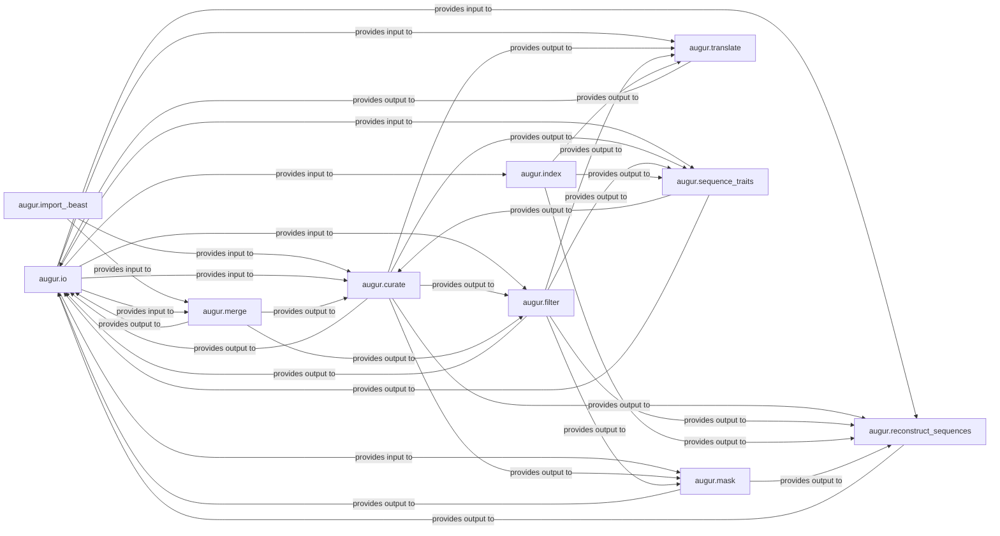

## Details

This component manages the entire lifecycle of raw data, transforming it from various input formats into a clean, structured format suitable for downstream analysis. It encompasses reading diverse file types, importing from external tools, merging datasets, and performing extensive data curation, filtering, subsampling, and low-level sequence/VCF manipulations.

### augur.io

This module serves as the primary interface for reading and writing various data formats, including sequences (FASTA), metadata (TSV), and strains. It abstracts the complexities of file handling and ensures data is correctly loaded into Augur's internal structures or saved to disk. It's fundamental because almost all data processing in Augur begins and ends with I/O operations.

**Related Classes/Methods**:

- `augur.io` (1:1)

### augur.import_.beast

Specifically designed to import data from BEAST XML files, which often contain phylogenetic trees, alignments, and associated metadata. This component is crucial for integrating results or data generated by external phylogenetic analysis tools into the Augur workflow. It's fundamental for interoperability with a common bioinformatics tool.

**Related Classes/Methods**:

- <a href="https://github.com/nextstrain/augur/augur/import_/beast.py#L1-L1" target="_blank" rel="noopener noreferrer">`augur.import_.beast` (1:1)</a>

### augur.merge

Responsible for combining disparate datasets, such as sequences with metadata, or merging multiple JSON files containing processed data. This component ensures that all relevant information is consolidated into a unified dataset for subsequent analysis steps. It's fundamental for integrating different data sources.

**Related Classes/Methods**:

- <a href="https://github.com/nextstrain/augur/augur/merge.py#L1-L1" target="_blank" rel="noopener noreferrer">`augur.merge` (1:1)</a>

### augur.curate

Applies various curation rules to the data, including parsing dates, handling geographic information, and validating metadata entries. This component ensures data quality and consistency, which is vital for accurate downstream analyses. It's fundamental for data quality control.

**Related Classes/Methods**:

- `augur.curate` (1:1)

### augur.filter

Provides functionalities for filtering data based on various criteria (e.g., quality, date, location) and subsampling datasets to manage size or achieve specific distributions. This is critical for focusing analyses on relevant subsets of data and managing computational load. It's fundamental for data reduction and selection.

**Related Classes/Methods**:

- `augur.filter` (1:1)

### augur.mask

Performs low-level manipulation of sequences, specifically masking regions based on predefined criteria or alignment gaps. This is important for removing unreliable or uninformative parts of sequences before phylogenetic analysis. It's fundamental for preparing sequences for alignment and tree building.

**Related Classes/Methods**:

- <a href="https://github.com/nextstrain/augur/augur/mask.py#L1-L1" target="_blank" rel="noopener noreferrer">`augur.mask` (1:1)</a>

### augur.index

Creates indices for large data files, particularly VCF (Variant Call Format) files, to enable efficient access and retrieval of specific data points. This is crucial for performance when working with large genomic datasets. It's fundamental for efficient data access.

**Related Classes/Methods**:

- <a href="https://github.com/nextstrain/augur/augur/index.py#L1-L1" target="_blank" rel="noopener noreferrer">`augur.index` (1:1)</a>

### augur.reconstruct_sequences

Reconstructs ancestral sequences or infers missing sequence data based on phylogenetic trees and existing sequences. This is a more advanced manipulation that prepares sequences for further evolutionary analysis. It's fundamental for inferring evolutionary history.

**Related Classes/Methods**:

- <a href="https://github.com/nextstrain/augur/augur/reconstruct_sequences.py#L1-L1" target="_blank" rel="noopener noreferrer">`augur.reconstruct_sequences` (1:1)</a>

### augur.translate

Translates nucleotide sequences into amino acid sequences. This is essential for analyses that operate at the protein level, such as identifying functional changes or predicting epitopes. It's fundamental for protein-level analysis.

**Related Classes/Methods**:

- <a href="https://github.com/nextstrain/augur/augur/translate.py#L1-L1" target="_blank" rel="noopener noreferrer">`augur.translate` (1:1)</a>

### augur.sequence_traits

Extracts specific traits or features directly from sequence data, such as identifying specific mutations or motifs. This component bridges raw sequence data with phenotypic or epidemiological information. It's fundamental for deriving insights directly from genetic data.

**Related Classes/Methods**:

- <a href="https://github.com/nextstrain/augur/augur/sequence_traits.py#L1-L1" target="_blank" rel="noopener noreferrer">`augur.sequence_traits` (1:1)</a>

### [FAQ](https://github.com/CodeBoarding/GeneratedOnBoardings/tree/main?tab=readme-ov-file#faq)