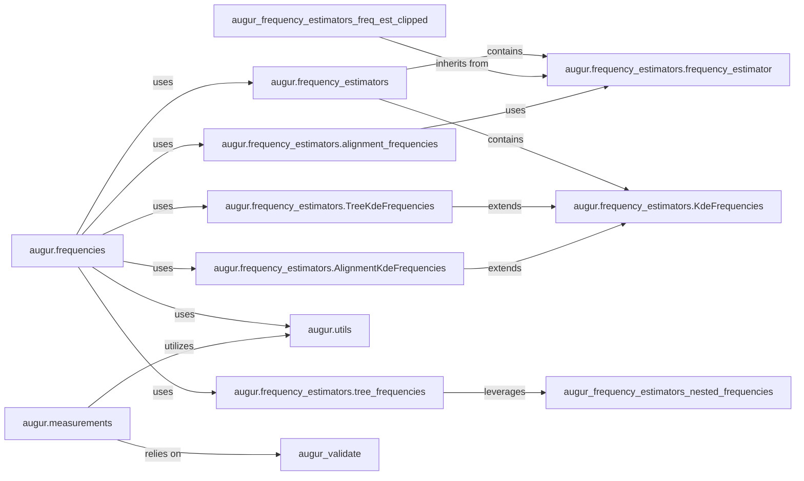

## Details

This subsystem focuses on the quantitative analysis of evolutionary patterns, specifically estimating frequencies of clades, genotypes, or mutations over time, and processing general quantitative measurements derived from phylogenetic contexts.

### augur.frequencies

This module serves as the primary interface and orchestrator for all frequency calculation workflows. It manages the overall process, including preparing input data, invoking various frequency estimation components, and formatting/outputting the calculated frequency results. It is the central control point for frequency analysis.

**Related Classes/Methods**:

- <a href="https://github.com/nextstrain/augur/augur/frequencies.py#L0-L0" target="_blank" rel="noopener noreferrer">`augur.frequencies` (0:0)</a>

### augur.frequency_estimators

This package is the core engine for all frequency estimation algorithms. It provides a comprehensive suite of classes and functions for various types of frequency calculations, including general estimation, tree-based, alignment-based, and Kernel Density Estimation (KDE) approaches. It encapsulates the diverse methodologies for frequency analysis.

**Related Classes/Methods**:

- <a href="https://github.com/nextstrain/augur/augur/frequency_estimators.py#L0-L0" target="_blank" rel="noopener noreferrer">`augur.frequency_estimators` (0:0)</a>

### augur.frequency_estimators.frequency_estimator

This is a foundational abstract base class that defines the common interface and core methods (e.g., `initial_guess`, `stiffLH`, `learn`) for all specific frequency estimation algorithms. It ensures consistency and provides a standardized structure for various estimation approaches.

**Related Classes/Methods**:

- <a href="https://github.com/nextstrain/augur/augur/frequency_estimators.py#L184-L318" target="_blank" rel="noopener noreferrer">`augur.frequency_estimators.frequency_estimator` (184:318)</a>

### augur.frequency_estimators.KdeFrequencies

This is a base class specifically designed for frequency estimation using Kernel Density Estimation (KDE). It provides methods for managing KDE parameters, estimating densities, and normalizing them into frequencies, serving as the foundation for KDE-based approaches.

**Related Classes/Methods**:

- <a href="https://github.com/nextstrain/augur/augur/frequency_estimators.py#L869-L1059" target="_blank" rel="noopener noreferrer">`augur.frequency_estimators.KdeFrequencies` (869:1059)</a>

### augur.frequency_estimators.TreeKdeFrequencies

This component extends `KdeFrequencies` to apply Kernel Density Estimation specifically to phylogenetic tree-related data, typically for estimating tip frequencies or other tree-derived measurements. It adapts KDE for tree structures.

**Related Classes/Methods**:

- <a href="https://github.com/nextstrain/augur/augur/frequency_estimators.py#L1062-L1213" target="_blank" rel="noopener noreferrer">`augur.frequency_estimators.TreeKdeFrequencies` (1062:1213)</a>

### augur.frequency_estimators.AlignmentKdeFrequencies

This component extends `KdeFrequencies` to apply Kernel Density Estimation to sequence alignment data, focusing on estimating frequencies of genotypes or mutations. It tailors KDE for alignment-based analysis.

**Related Classes/Methods**:

- <a href="https://github.com/nextstrain/augur/augur/frequency_estimators.py#L1216-L1275" target="_blank" rel="noopener noreferrer">`augur.frequency_estimators.AlignmentKdeFrequencies` (1216:1275)</a>

### augur.frequency_estimators.tree_frequencies

This component specializes in estimating frequencies specifically within the context of phylogenetic trees, focusing on clades or branches. It prepares tree data and then estimates clade frequencies, providing tree-specific analytical capabilities.

**Related Classes/Methods**:

- <a href="https://github.com/nextstrain/augur/augur/frequency_estimators.py#L463-L608" target="_blank" rel="noopener noreferrer">`augur.frequency_estimators.tree_frequencies` (463:608)</a>

### augur.frequency_estimators.alignment_frequencies

This component is dedicated to estimating frequencies from sequence alignment data, specifically for genotypes and mutations. It processes alignment information to derive frequency estimates, enabling mutation and genotype tracking.

**Related Classes/Methods**:

- <a href="https://github.com/nextstrain/augur/augur/frequency_estimators.py#L611-L756" target="_blank" rel="noopener noreferrer">`augur.frequency_estimators.alignment_frequencies` (611:756)</a>

### augur.measurements

This module is responsible for managing and processing general quantitative measurement data within the phylogenetic context. It handles tasks such as concatenating various measurement datasets and preparing them for export or further analysis, providing support for diverse quantitative data.

**Related Classes/Methods**:

- `augur.measurements` (0:0)

### augur.utils

This module provides a collection of common utility functions used throughout the Augur project. These include general-purpose operations such as JSON writing, file operations, and other helper functions that support various modules, including frequency and measurement analysis. It acts as a shared toolkit.

**Related Classes/Methods**:

- <a href="https://github.com/nextstrain/augur/augur/utils.py#L0-L0" target="_blank" rel="noopener noreferrer">`augur.utils` (0:0)</a>

### [FAQ](https://github.com/CodeBoarding/GeneratedOnBoardings/tree/main?tab=readme-ov-file#faq)