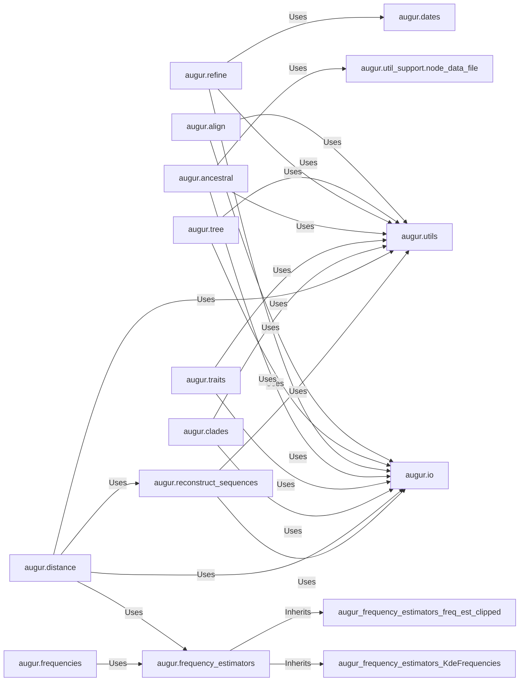

## Details

These components are fundamental because they represent distinct, yet interconnected, stages of the phylogenetic analysis pipeline. `augur.align` and `augur.tree` are the initial steps, providing the foundational data structure (aligned sequences and phylogenetic trees). `augur.refine` then enhances these trees. `augur.ancestral`, `augur.traits`, `augur.clades`, and `augur.distance` represent the core analytical capabilities, deriving insights from the constructed trees. `augur.reconstruct_sequences` supports these analyses by providing necessary intermediate data. `augur.frequency_estimators` and `augur.frequencies` provide the statistical backbone for many of the quantitative analyses. Finally, `augur.io`, `augur.utils`, `augur.dates`, and `augur.util_support.node_data_file` are essential support components, handling data flow, common operations, temporal data, and node-specific information, respectively, making the entire workflow possible.

### augur.align

Manages the alignment of input sequences, a prerequisite for phylogenetic tree construction. It orchestrates external alignment tools.

**Related Classes/Methods**:

- <a href="https://github.com/nextstrain/augur/augur/align.py#L0-L0" target="_blank" rel="noopener noreferrer">`augur.align` (0:0)</a>

### augur.tree

Responsible for constructing phylogenetic trees from aligned sequences. This module interfaces with various tree-building algorithms (e.g., IQ-TREE, RAxML, FastTree) by invoking external command-line tools.

**Related Classes/Methods**:

- <a href="https://github.com/nextstrain/augur/augur/tree.py#L0-L0" target="_blank" rel="noopener noreferrer">`augur.tree` (0:0)</a>

### augur.refine

Provides functionalities to refine existing phylogenetic trees. This can include operations such as rooting trees, resolving polytomies, or pruning branches based on specific criteria like dates or metadata.

**Related Classes/Methods**:

- <a href="https://github.com/nextstrain/augur/augur/refine.py#L0-L0" target="_blank" rel="noopener noreferrer">`augur.refine` (0:0)</a>

### augur.ancestral

Infers ancestral sequences and states (traits) at the internal nodes of a phylogenetic tree. This is crucial for reconstructing evolutionary pathways and understanding character evolution.

**Related Classes/Methods**:

- <a href="https://github.com/nextstrain/augur/augur/ancestral.py#L0-L0" target="_blank" rel="noopener noreferrer">`augur.ancestral` (0:0)</a>

### augur.traits

Infers ancestral traits (e.g., geographic location, host, phenotype) across the phylogenetic tree, providing insights into the evolution and spread of non-sequence characteristics.

**Related Classes/Methods**:

- <a href="https://github.com/nextstrain/augur/augur/traits.py#L0-L0" target="_blank" rel="noopener noreferrer">`augur.traits` (0:0)</a>

### augur.clades

Identifies, defines, and calculates properties of clades (monophyletic groups) within a phylogenetic tree, often based on shared ancestry or specific genetic markers.

**Related Classes/Methods**:

- <a href="https://github.com/nextstrain/augur/augur/clades.py#L0-L0" target="_blank" rel="noopener noreferrer">`augur.clades` (0:0)</a>

### augur.distance

Calculates genetic distances between sequences or nodes within the phylogenetic context. This module quantifies evolutionary divergence and is essential for various downstream analyses.

**Related Classes/Methods**:

- <a href="https://github.com/nextstrain/augur/augur/distance.py#L0-L0" target="_blank" rel="noopener noreferrer">`augur.distance` (0:0)</a>

### augur.reconstruct_sequences

Provides functionality to reconstruct ancestral or intermediate sequences along the branches of a phylogenetic tree. This is a foundational step for certain distance calculations and ancestral state inferences.

**Related Classes/Methods**:

- <a href="https://github.com/nextstrain/augur/augur/reconstruct_sequences.py#L0-L0" target="_blank" rel="noopener noreferrer">`augur.reconstruct_sequences` (0:0)</a>

### augur.frequency_estimators

A comprehensive module offering various algorithms and classes for estimating frequencies (e.g., genotype frequencies, mutation frequencies, clade frequencies, Kernel Density Estimation-based frequencies). It serves as a statistical backbone for components like `augur.distance`.

**Related Classes/Methods**:

- <a href="https://github.com/nextstrain/augur/augur/frequency_estimators.py#L0-L0" target="_blank" rel="noopener noreferrer">`augur.frequency_estimators` (0:0)</a>

### augur.io

This is a meta-component representing the input/output operations crucial for all other components. It includes sub-modules like `augur.io.file`, `augur.io.sequences`, `augur.io.shell_command_runner`, and `augur.io.metadata`.

**Related Classes/Methods**:

- `augur.io` (0:0)

### augur.utils

Provides general utility functions that are widely used across various components for common tasks, ensuring code reusability and consistency.

**Related Classes/Methods**:

- <a href="https://github.com/nextstrain/augur/augur/utils.py#L0-L0" target="_blank" rel="noopener noreferrer">`augur.utils` (0:0)</a>

### augur.dates

Manages date-related functionalities, particularly important for time-resolved phylogenies and refining trees based on temporal information.

**Related Classes/Methods**:

- `augur.dates` (0:0)

### augur.util_support.node_data_file

Manages node-specific data files, which are essential for storing and retrieving information associated with individual nodes in the phylogenetic tree.

**Related Classes/Methods**:

- <a href="https://github.com/nextstrain/augur/augur/util_support/node_data_file.py#L0-L0" target="_blank" rel="noopener noreferrer">`augur.util_support.node_data_file` (0:0)</a>

### augur.frequencies

Handles frequency-related operations, often leveraging the more specialized `augur.frequency_estimators` for complex calculations.

**Related Classes/Methods**:

- <a href="https://github.com/nextstrain/augur/augur/frequencies.py#L0-L0" target="_blank" rel="noopener noreferrer">`augur.frequencies` (0:0)</a>

### [FAQ](https://github.com/CodeBoarding/GeneratedOnBoardings/tree/main?tab=readme-ov-file#faq)