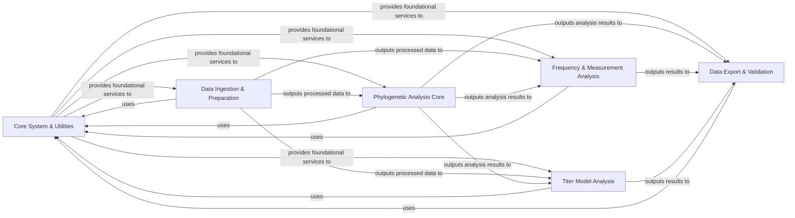

## Details

Final Architecture Analysis for `augur`

### Core System & Utilities [[Expand]](./Core_System_Utilities.md)

This foundational component provides essential services and utilities that underpin the entire Augur application. It handles command-line argument parsing, version management, robust error handling, and offers general-purpose utilities for file I/O, JSON serialization, and common data structures. It acts as the central nervous system, offering essential building blocks and configuration.

**Related Classes/Methods**:

- <a href="https://github.com/nextstrain/augur/augur/__init__.py#L0-L0" target="_blank" rel="noopener noreferrer">`augur.__init__` (0:0)</a>

- <a href="https://github.com/nextstrain/augur/augur/__main__.py#L0-L0" target="_blank" rel="noopener noreferrer">`augur.__main__` (0:0)</a>

- <a href="https://github.com/nextstrain/augur/augur/argparse_.py#L0-L0" target="_blank" rel="noopener noreferrer">`augur.argparse_` (0:0)</a>

- <a href="https://github.com/nextstrain/augur/augur/errors.py#L0-L0" target="_blank" rel="noopener noreferrer">`augur.errors` (0:0)</a>

- <a href="https://github.com/nextstrain/augur/augur/types.py#L0-L0" target="_blank" rel="noopener noreferrer">`augur.types` (0:0)</a>

- <a href="https://github.com/nextstrain/augur/augur/utils.py#L0-L0" target="_blank" rel="noopener noreferrer">`augur.utils` (0:0)</a>

- <a href="https://github.com/nextstrain/augur/augur/debug.py#L0-L0" target="_blank" rel="noopener noreferrer">`augur.debug` (0:0)</a>

- <a href="https://github.com/nextstrain/augur/augur/version.py#L0-L0" target="_blank" rel="noopener noreferrer">`augur.version` (0:0)</a>

- `augur.util_support` (0:0)

### Data Ingestion & Preparation [[Expand]](./Data_Ingestion_Preparation.md)

Manages the entire lifecycle of raw data from input to a clean, structured format ready for analysis. This includes reading various file formats (FASTA, VCF, TSV, JSON), importing from external tools (e.g., BEAST XML), merging disparate datasets, and performing extensive curation, filtering, subsampling, and low-level sequence/VCF manipulations (e.g., masking, indexing, translation).

**Related Classes/Methods**:

- `augur.io` (0:0)

- <a href="https://github.com/nextstrain/augur/augur/read_file.py#L0-L0" target="_blank" rel="noopener noreferrer">`augur.read_file` (0:0)</a>

- <a href="https://github.com/nextstrain/augur/augur/write_file.py#L0-L0" target="_blank" rel="noopener noreferrer">`augur.write_file` (0:0)</a>

- <a href="https://github.com/nextstrain/augur/augur/import_/beast.py#L0-L0" target="_blank" rel="noopener noreferrer">`augur.import_.beast` (0:0)</a>

- <a href="https://github.com/nextstrain/augur/augur/merge.py#L0-L0" target="_blank" rel="noopener noreferrer">`augur.merge` (0:0)</a>

- `augur.curate` (0:0)

- <a href="https://github.com/nextstrain/augur/augur/parse.py#L0-L0" target="_blank" rel="noopener noreferrer">`augur.parse` (0:0)</a>

- `augur.dates` (0:0)

- `augur.filter` (0:0)

- <a href="https://github.com/nextstrain/augur/augur/mask.py#L0-L0" target="_blank" rel="noopener noreferrer">`augur.mask` (0:0)</a>

- <a href="https://github.com/nextstrain/augur/augur/index.py#L0-L0" target="_blank" rel="noopener noreferrer">`augur.index` (0:0)</a>

- <a href="https://github.com/nextstrain/augur/augur/reconstruct_sequences.py#L0-L0" target="_blank" rel="noopener noreferrer">`augur.reconstruct_sequences` (0:0)</a>

- <a href="https://github.com/nextstrain/augur/augur/translate.py#L0-L0" target="_blank" rel="noopener noreferrer">`augur.translate` (0:0)</a>

- <a href="https://github.com/nextstrain/augur/augur/sequence_traits.py#L0-L0" target="_blank" rel="noopener noreferrer">`augur.sequence_traits` (0:0)</a>

### Phylogenetic Analysis Core [[Expand]](./Phylogenetic_Analysis_Core.md)

This component encapsulates the primary phylogenetic workflow, including sequence alignment, constructing and refining phylogenetic trees using various algorithms (e.g., IQ-TREE, RAxML, FastTree), inferring ancestral sequences and traits, and calculating clades and genetic distances.

**Related Classes/Methods**:

- <a href="https://github.com/nextstrain/augur/augur/align.py#L0-L0" target="_blank" rel="noopener noreferrer">`augur.align` (0:0)</a>

- <a href="https://github.com/nextstrain/augur/augur/tree.py#L0-L0" target="_blank" rel="noopener noreferrer">`augur.tree` (0:0)</a>

- <a href="https://github.com/nextstrain/augur/augur/refine.py#L0-L0" target="_blank" rel="noopener noreferrer">`augur.refine` (0:0)</a>

- <a href="https://github.com/nextstrain/augur/augur/ancestral.py#L0-L0" target="_blank" rel="noopener noreferrer">`augur.ancestral` (0:0)</a>

- <a href="https://github.com/nextstrain/augur/augur/traits.py#L0-L0" target="_blank" rel="noopener noreferrer">`augur.traits` (0:0)</a>

- <a href="https://github.com/nextstrain/augur/augur/clades.py#L0-L0" target="_blank" rel="noopener noreferrer">`augur.clades` (0:0)</a>

- <a href="https://github.com/nextstrain/augur/augur/distance.py#L0-L0" target="_blank" rel="noopener noreferrer">`augur.distance` (0:0)</a>

### Frequency & Measurement Analysis [[Expand]](./Frequency_Measurement_Analysis.md)

Focuses on quantitative analysis of evolutionary patterns, specifically estimating frequencies of clades, genotypes, or mutations over time, and processing general quantitative measurements data derived from the phylogenetic context.

**Related Classes/Methods**:

- <a href="https://github.com/nextstrain/augur/augur/frequencies.py#L0-L0" target="_blank" rel="noopener noreferrer">`augur.frequencies` (0:0)</a>

- <a href="https://github.com/nextstrain/augur/augur/frequency_estimators.py#L0-L0" target="_blank" rel="noopener noreferrer">`augur.frequency_estimators` (0:0)</a>

- `augur.measurements` (0:0)

### Titer Model Analysis

This component develops and applies models to predict antibody titers based on sequence and phylogenetic data, often involving substitution or tree-based models to understand immunological responses.

**Related Classes/Methods**:

- <a href="https://github.com/nextstrain/augur/augur/titer_model.py#L0-L0" target="_blank" rel="noopener noreferrer">`augur.titer_model` (0:0)</a>

- <a href="https://github.com/nextstrain/augur/augur/titers.py#L0-L0" target="_blank" rel="noopener noreferrer">`augur.titers` (0:0)</a>

### Data Export & Validation

This component is responsible for formatting and exporting all processed phylogenetic and associated data into JSON files compatible with the Auspice visualization tool. It also includes robust validation of these exported data structures against defined schemas to ensure data integrity and compatibility.

**Related Classes/Methods**:

- <a href="https://github.com/nextstrain/augur/augur/export_v1.py#L0-L0" target="_blank" rel="noopener noreferrer">`augur.export_v1` (0:0)</a>

- <a href="https://github.com/nextstrain/augur/augur/export_v2.py#L0-L0" target="_blank" rel="noopener noreferrer">`augur.export_v2` (0:0)</a>

- <a href="https://github.com/nextstrain/augur/augur/validate.py#L0-L0" target="_blank" rel="noopener noreferrer">`augur.validate` (0:0)</a>

- <a href="https://github.com/nextstrain/augur/augur/validate_export.py#L0-L0" target="_blank" rel="noopener noreferrer">`augur.validate_export` (0:0)</a>

### [FAQ](https://github.com/CodeBoarding/GeneratedOnBoardings/tree/main?tab=readme-ov-file#faq)