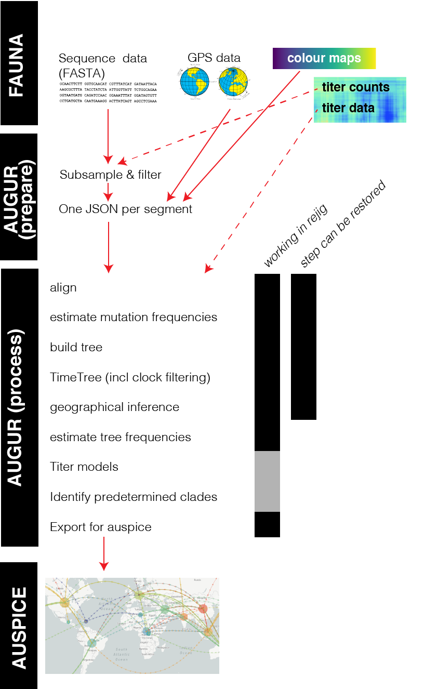

## AUGUR

## How to run
* see the `README.md` files in the respective pathogen's folder

## Docs:
* [Fauna](https://github.com/nextstrain/fauna)
* [Prepare](prepare.md)
* [Process](process.md)
* [Format of (auspice) output JSONs](auspice_output.md)
