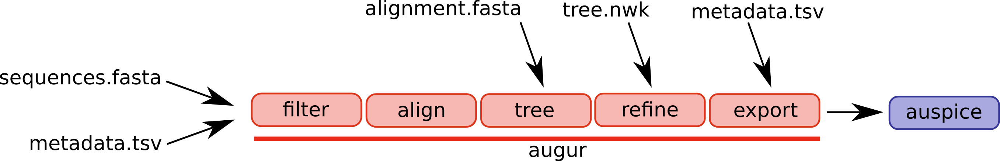

=========================================================
Augur: A bioinformatics toolkit for phylogenetic analysis
=========================================================

    *One held to foretell events by omens.*
    (`Merriam-Webster <https://www.merriam-webster.com/dictionary/augur>`__)

.. note::
   The documentation you are viewing is Augur's reference guide, which means it is information-oriented and targeted at users who just need info about how Augur works.

   * If you have a question about how to achieve a specific goal with Augur, check out our :doc:`Augur-focused How-to Guides section <docs.nextstrain.org:guides/bioinformatics/index>` in the main Nextstrain documentation.
   * If you want to learn the basics of how to use Augur from scratch, check out :doc:`docs.nextstrain.org:tutorials/creating-a-phylogenetic-workflow` in the main Nextstrain documentation.
   * If you want to understand how Augur fits together with Auspice to visualize results, check out our :doc:`Data Formats section <docs.nextstrain.org:reference/data-formats>` in the main Nextstrain documentation.

Augur is a bioinformatics toolkit to track evolution from sequence and serological data.
It provides a collection of commands which are designed to be composable into larger processing pipelines.
Augur originated as part of `Nextstrain <https://nextstrain.org>`__, an open-source project to harness the scientific and public health potential of pathogen genome data.
All source code is available on `GitHub <https://github.com/nextstrain/augur>`__.

Augur is composed of a series of modules and different workflows will use different parts of the pipeline.
A selection of augur modules and different possible entry points are illustrated below.

The canonical pipeline would ingest sequences and metadata such as dates and sampling locations, filter the data, align the sequences, infer a tree, and export the results in a format that can be visualized by auspice.

In some cases, you might start with a manually curated alignment and want to start the workflow at the tree building step.
Or you already have a tree inferred. In this case, you only need to feed you tree through the ``refine`` and ``export`` steps.
The ``refine`` step is necessary to ensure that cross-referencing between tree nodes and meta data works as expected.

The different augur modules can be strung together by workflow managers like snakemake and nextflow.
The nextstrain team uses `snakemake <https://snakemake.readthedocs.io/en/stable/>`__ to run and manage the different analysis that you see on `nextstrain.org <https://nextstrain.org>`__.

.. toctree::
   :maxdepth: 2
   :caption: Table of contents
   :name: mastertoc
   :titlesonly:

   installation/installation
   usage/usage
   releases/releases
   faq/faq
   examples/examples
   api/public/index
   api/developer/index
   authors/authors
